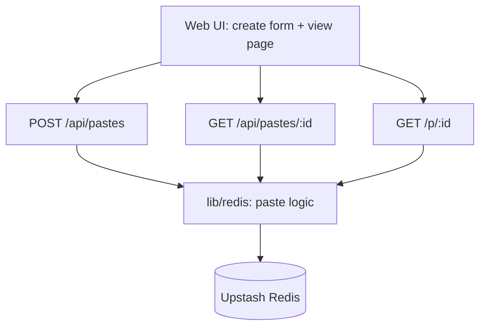

# STATE — <!-- updated: 2026-09-02 -->

## Current focus
Sharetxt is deployed and live on Vercel (https://sharetxt-mu.vercel.app) with Upstash Redis, verified end-to-end against the production URL. Front end restyled (Aganitha-inspired) with light/dark themes.

## Shape

## Done
- Four routes: `POST /api/pastes`, `GET /api/pastes/:id`, `GET /p/:id`, `GET /api/healthz`.
- TTL + view-count constraints with atomic `INCR`; deterministic time via `x-test-now-ms` under `TEST_MODE=1`.
- Create UI + safe (escaped) HTML view page; styled unavailable/expired page (`app/not-found.tsx`).
- Light + dark themes (system-aware + manual toggle, no-FOUC init script).
- Copy-to-clipboard on both the created link and the shared paste.
- Shared HTTP contract types (`lib/types.ts`) imported by client and server to prevent drift.
- SVG logo/favicon (`app/icon.svg`).
- Deployed to Vercel + Upstash Redis; verified end-to-end against the production URL, including concurrency and adversarial inputs.

## In progress
- Nothing.

## Next up
- Nothing outstanding. Optional: custom domain, backstop key TTL for GC.

## Blocked / needs research
- None.

## Known issues
- Expired/exhausted paste keys linger in Redis (no GC); harmless, add a backstop `EXPIRE` if key growth matters.
- `TEST_MODE=1` in production makes expiry client-spoofable via `x-test-now-ms` — intentional, required by the grader.
